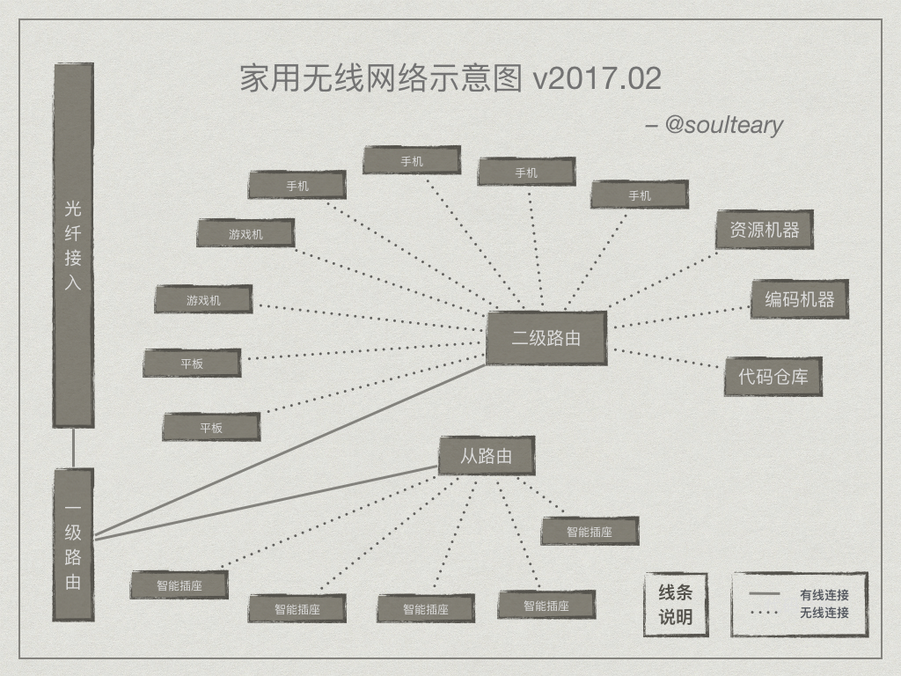

# 无线使用

> 当前使用的无线网络结构示意图

## 二级路由外接这么多设备真的没问题么

- 参见[整体网络结构](./network-topology.md)，有线流量已被分流至交换机，二级路由仅做AP，处理无线流量以及与有线数据交互的部分，曾经测试时把所有的无线设备都同时开启备份和软件升级操作，网络正常使用。

## 为何要额外添加一台从路由

- 部分设备不支持AES-WPK2加密方式的无线，并且可能存在临时入网的设备，不过分降低整体网络安全性，以及增加维护复杂度的情况下，水平添加一台路由做临时网络接入是相对靠谱的方案。
- 网络插座存在潜在的安全风险，使用物理路由隔离相比较在路由上做策略，半年之后的可维护性更高。

## 网络性能报告

（网络中存活30+设备，并有下载活动）

- [二级网段-5G无线测试](../report/wireless/01.internal-5g-test.md)：平均 37MB/s。
- [二级网段-2G无线测试](../report/wireless/02.internal-2g-test.md)：平均 5MB/s。
- [二级网段到一级网段-5G无线测试](../report/wireless/01.internal-5g-test.md)：平均 43.2MB/s。
- [二级网段到一级网段-2G无线测试](../report/wireless/04.2g-public-cross-test.md)：平均 6MB/s。
- [一级网段-5G无线测试](../report/wireless/05.5g-public-test.md)：平均 43.1MB/s。

## 待补充

- 内网多台设备一起进行无线备份时的速度／延迟

## 历史性能记录

- 2017.02.16 磁盘满，Mac使用Resilio Sync向局域网一台主机（储存介质为M2 & SATA两块SSD）同步照片10G+，上传速度33～41.6MB/s。

